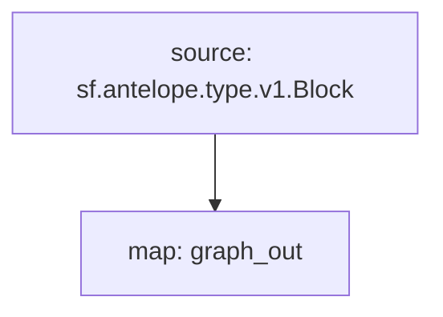

# Subgraph: `Antelope Tokens`

> Token Balances & Supply
>
> WAX, EOS, Ultra, Telos...
> [`sf.antelope.type.v1.Block`](https://buf.build/pinax/firehose-antelope/docs/main:sf.antelope.type.v1)

- [x] **Balances**
- [x] **Supply**

## Chains

- **API Key**: <https://thegraph.com/studio/apikeys/>
- **Base URL**: <https://gateway.thegraph.com/api>
- **Subgraph ID**:
  - `WAX_SUBGRAPH_ID`
  - `EOS_SUBGRAPH_ID`
- **Subgraph NFT**:
  - `WAX_SUBGRAPH_ID`
  - `EOS_SUBGRAPH_ID`
- **Query URL format**: `{base_url}`/api/`{api-key}`/subgraphs/id/`{subgraph_id}`

| Chain | Subgraph ID |
| ----- | ----------- |
| WAX   | [`WAX_SUBGRAPH_ID`](https://thegraph.com/explorer/subgraphs/WAX_SUBGRAPH_ID?view=Query&chain=arbitrum-one) |
| EOS   | [`EOS_SUBGRAPH_ID`](https://thegraph.com/explorer/subgraphs/EOS_SUBGRAPH_ID?view=Query&chain=arbitrum-one) |

## GraphQL

```graphql
query{
  tokens(where:{supply_:{amount_gt: 0}}){
    code
    symcode
    supply{
      value
    }
    balances(first: 5,orderBy:amount, orderDirection:desc){
      owner
      value
    }
  }
}
```

## Substreams Modules


