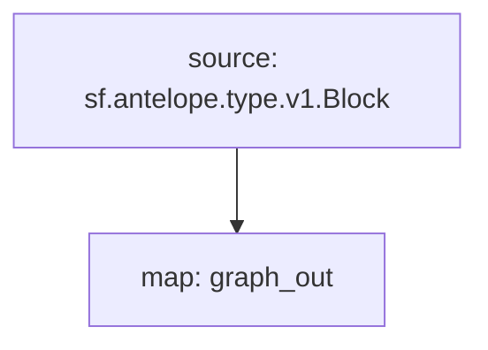

# Subgraph: `Antelope Tokens`

> Token Balances & Supply
>
> WAX, EOS, Ultra, Telos...
> [`sf.antelope.type.v1.Block`](https://buf.build/pinax/firehose-antelope/docs/main:sf.antelope.type.v1)

- [x] **Balances**
- [x] **Supply** & **Max Supply**

## Chains

- **API Key**: <https://thegraph.com/studio/apikeys/>
- **Base URL**: <https://gateway.thegraph.com/api>
- **Query URL format**: `{base_url}`/api/`{api-key}`/subgraphs/id/`{subgraph_id}`

| Chain | Subgraph ID |
| ----- | ----------- |
| WAX   | [`6Tt5mHVNDyAo3KbsYMUeemmzs2381vXUquXw75EnG9cW`](https://thegraph.com/explorer/subgraphs/6Tt5mHVNDyAo3KbsYMUeemmzs2381vXUquXw75EnG9cW?view=Query&chain=arbitrum-one) |
| EOS   | [`Ce1om4KPxZHwFxhtz2pVuCD4AUiKisrYecHVWsvEW6MU`](https://thegraph.com/explorer/subgraphs/Ce1om4KPxZHwFxhtz2pVuCD4AUiKisrYecHVWsvEW6MU?view=Query&chain=arbitrum-one) |
| Kylin   | [`B7YqehhCQyZmqCPL6raVv8ncqzLq69EFirjf7Gnfiv7A`](https://thegraph.com/explorer/subgraphs/B7YqehhCQyZmqCPL6raVv8ncqzLq69EFirjf7Gnfiv7A?view=Query&chain=arbitrum-one) |

## GraphQL

**Balances by Owner**

```graphql
query BalanceByOwner{
  balances(first: 20, where:{ owner: "eosio.stake" }) {
    balance
    token{
     code
      symcode
      precision
    }
  }
}
```

**Tokens by Top Holders**

```graphql
query TokensHolders {
  balances(where: {token_: {code: "eosio.token"}} orderBy: balance, orderDirection: desc) {
    owner
    balance
    token{
     code
      symcode
    }
  }
}
```

**Token Supply**

```graphql
query Supply {
  supplies(first: 20, orderBy: block__number, orderDirection: desc){
    supply
    max_supply
    token{
      code
      symcode
      precision
    }
  }
}
```

**Recent Balances Changes**

```graphql
query RecentBalancesChanges {
  balances(first: 20, orderBy: block__number, orderDirection: desc) {
    owner
    balance
    token{
     code
     symcode
    }
  block{
      number
      date
    }
  }
}
```

## Substreams Modules



## Subgraph deployment

```bash
graph indexer rules prepare --network arbitrum-one <Qm>
graph indexer allocations create <Qm> arbitrum-one 100
```
