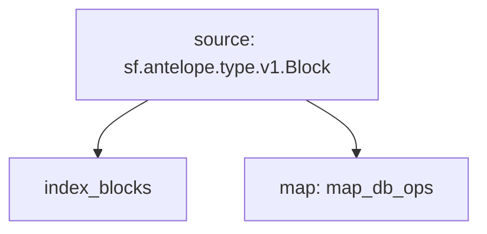

# Substreams: `Antelope Tokens` Block Index

## Graph



## Modules

**v0.3.0**

```bash
Name: index_blocks
Initial block: 0
Kind: index
Input: source: sf.antelope.type.v1.Block
Output Type: proto:sf.substreams.index.v1.Keys
Hash: 763818447081d01909d12ee76814bd0e25fa1296

Name: map_db_ops
Initial block: 0
Kind: map
Input: source: sf.antelope.type.v1.Block
Block Filter: (using *index_blocks*): `&{db.table:accounts || db.table:stat}`
Output Type: proto:sf.antelope.type.v1.DBOps
Hash: ee87ed402ae51b2e773f67286fd7b08e66a6afd1
```

**v0.1.0**

```bash
Name: index_blocks
Initial block: 0
Kind: index
Input: source: sf.antelope.type.v1.Block
Output Type: proto:sf.substreams.index.v1.Keys
Hash: 15f03d68c8b56336999fac6be2a3d1c6d558288b

Name: map_db_ops
Initial block: 0
Kind: map
Input: source: sf.antelope.type.v1.Block
Block Filter: (using *index_blocks*): `&{db.table:accounts || db.table:stat}`
Output Type: proto:sf.antelope.type.v1.DBOps
Hash: 9df5eeba09d51a87ea9eaf3ca18a13111cc495b1
```
