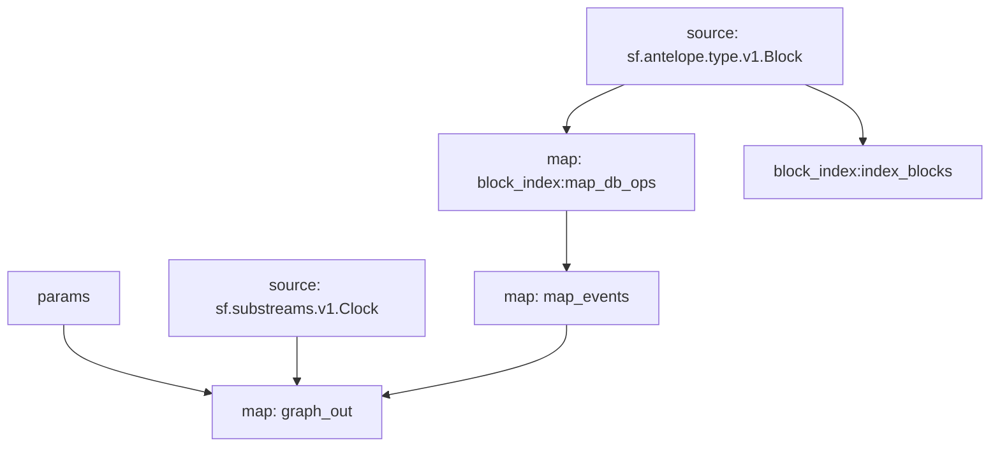

# Substreams: `Antelope Tokens`

### Example queries

- `code:eosio.token`
- `symcode:EOS`
- `sym:4,EOS`
- `owner:eosio.stake`
- `owner:eosio.stake && code:eosio.token`
- `token:4,EOS@eosio.token`

### Available query fields

These are the expressions that can be used in queries:

- `contract:<contract>` - token contract account name
- `token:<extended_symbol>` - extended token symbol

Queries can include `&&` and `||` logical operands, as well as `(` and `)` parenthesis.

## Graph



## Modules

```bash
Name: map_events
Initial block: 0
Kind: map
Input: map: block_index:map_db_ops
Output Type: proto:antelope.tokens.v1.Events
Hash: 9fe8823c81d03ba73a1cedc64af1d91c539809e8

Name: graph_out
Initial block: 0
Kind: map
Input: params:
Input: source: sf.substreams.v1.Clock
Input: map: map_events
Output Type: proto:sf.substreams.sink.entity.v1.EntityChanges
Hash: 9cd168c6c87dc6ce6f78aa59fe788c0da479f4ed

Name: block_index:index_blocks
Initial block: 0
Kind: index
Input: source: sf.antelope.type.v1.Block
Output Type: proto:sf.substreams.index.v1.Keys
Hash: 15f03d68c8b56336999fac6be2a3d1c6d558288b

Name: block_index:map_db_ops
Initial block: 0
Kind: map
Input: source: sf.antelope.type.v1.Block
Block Filter: (using *block_index:index_blocks*): `&{db.table:accounts || db.table:stat}`
Output Type: proto:sf.antelope.type.v1.DBOps
Hash: 9df5eeba09d51a87ea9eaf3ca18a13111cc495b1
```
