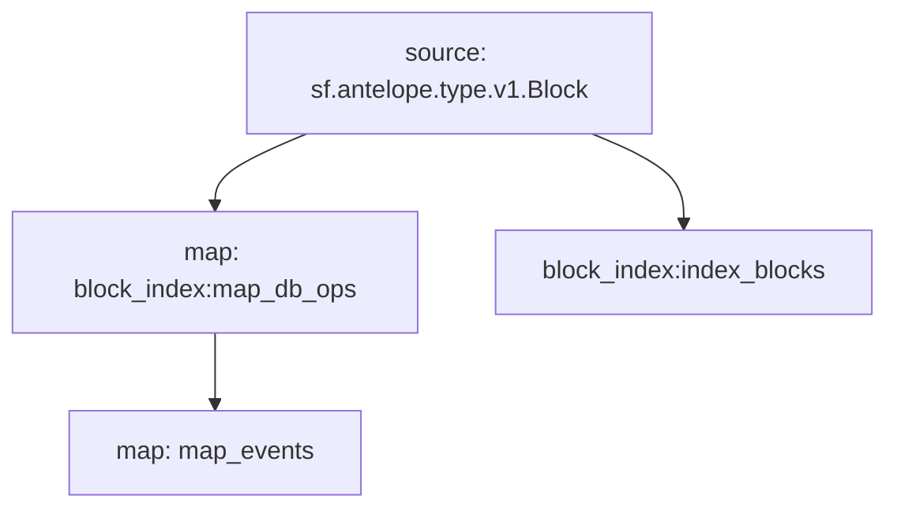

# Substreams: `Antelope Tokens` Events

## Events

- `balance`
- `supply`

## Graph



## Modules

```bash
Name: map_events
Initial block: 0
Kind: map
Input: map: block_index:map_db_ops
Output Type: proto:antelope.tokens.v1.Events
Hash: 0914a5441e13fefa1efb950947b8c506eab1a2e7

Name: block_index:index_blocks
Initial block: 0
Kind: index
Input: source: sf.antelope.type.v1.Block
Output Type: proto:sf.substreams.index.v1.Keys
Hash: 15f03d68c8b56336999fac6be2a3d1c6d558288b

Name: block_index:map_db_ops
Initial block: 0
Kind: map
Input: source: sf.antelope.type.v1.Block
Block Filter: (using *block_index:index_blocks*): `&{db.table:accounts || db.table:stat}`
Output Type: proto:sf.antelope.type.v1.DBOps
Hash: 9df5eeba09d51a87ea9eaf3ca18a13111cc495b1
```
